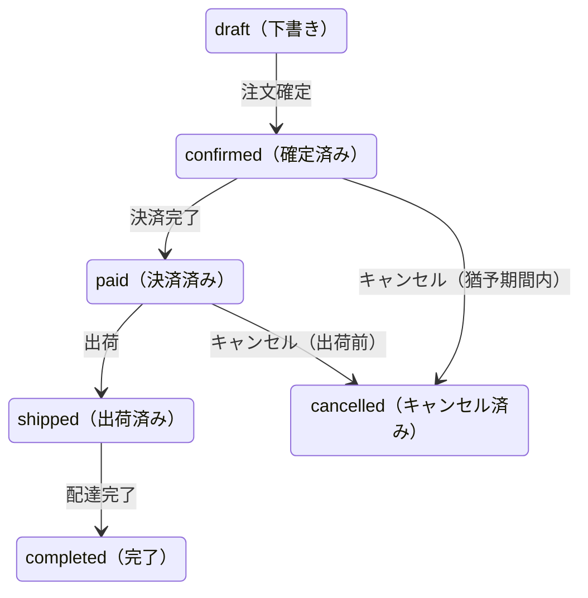

# 注文管理（OrderManagement）ビジネスルール — サンプル

> このファイルは miko スキルの品質基準を示すサンプルです。
> 実際のプロジェクトのビジネスルールではありません。
>
> 各ルールが「なぜビジネスルールなのか」を示すために、判定根拠をコメントで付記しています。
> 実際の business_rules.md ではこのコメントは不要です。

## 背景

ECサイトにおいて、注文の作成から完了までのライフサイクルを管理する必要がある。

従来は注文ステータスを単一のフラグで管理していたが、決済・配送・返品の各フェーズで独立した状態管理が必要になり、注文管理ケイパビリティとして再設計された。

---

## 状態遷移

| トリガー | 遷移 | 条件 |
|----------|------|------|
| 注文確定 | draft → confirmed | 在庫引き当て済み |
| 決済完了 | confirmed → paid | 決済プロバイダからの成功通知 |
| キャンセル | confirmed/paid → cancelled | 出荷前かつ猶予期間内 |
| 出荷 | paid → shipped | 配送業者への引き渡し完了 |
| 配達完了 | shipped → completed | 配達完了通知 |

---

## 1. 操作の定義（Operations）

### ユーザー操作（API）
- **注文作成** — ユーザーがカートの内容から注文を作成する。
- **注文確定** — ユーザーが注文内容を確認し確定する。
- **注文キャンセル** — ユーザーが注文をキャンセルする。

### イベント駆動
- **決済完了通知** — 決済プロバイダからの通知で決済完了を受け付ける。
- **配達完了通知** — 配送業者からの通知で注文を完了状態に遷移させる。

### バッチ処理
- **未決済注文の自動キャンセル** — 一定時間内に決済が完了しない注文を自動キャンセルする。

---

## 2. ビジネスルール・カタログ

### 注文ライフサイクル（ORD）

<!-- 各ルールに判定根拠を付記（サンプル専用。実際のドキュメントでは不要） -->

**ルール:**
- **ORD-01** [制約] バックオーダー（在庫なし受注）は受け付けない。注文確定時点で在庫が引き当て済みでなければならない。
  <!-- 判定: 代替案「バックオーダーを受け付け、入荷後に出荷する」は合理的な別方式 → ビジネスルール -->
- **ORD-02** [制約] 出荷済みの注文はユーザー操作ではキャンセルできない。返品プロセスへ誘導する。
  <!-- 判定: 代替案「出荷後もキャンセル可能にし、配送を止める」はありえる → ビジネスルール -->
- **ORD-03** [導出] キャンセル猶予期間は注文確定から24時間と定義する。
  <!-- 判定: 48時間でも即時不可でもよい。24時間はビジネスが決めた値 → ビジネスルール -->
- **ORD-04** [制約] 猶予期間経過後のキャンセルは管理者操作でのみ可能とする。
  <!-- 判定: 代替案「猶予期間後は一切キャンセル不可」「カスタマーサポート経由で受付」→ ビジネスルール -->

実装マッピング

- ORD-01 → `Ec::Order#confirmable?` / 在庫確認ロジック
- ORD-02 → `Ec::Order#cancellable?` / ステータス判定
- ORD-02 → `Ec::OrdersController#cancel` / キャンセル前のガード
- ORD-03 → `Ec::Order::CANCEL_GRACE_PERIOD` / 定数定義
- ORD-04 → `Ec::OrderPolicy#cancel?` / ロール判定

<!-- last: ORD-04 -->

---

### 決済連携（PAY）

**ルール:**
- **PAY-01** [制約] 決済プロバイダの応答失敗は注文確定をロールバックしない。非同期リトライで整合性を回復する。
  <!-- 判定: 代替案「決済完了を同期で待ち、失敗したら注文確定もロールバック」は堅実な別方式 → ビジネスルール -->
- **PAY-02** [導出] 確定から24時間以内に決済が完了しない注文は自動キャンセル対象と定義する。
  <!-- 判定: 48時間でも「無期限に待つ」でもよい → ビジネスルール -->
- **PAY-03** [制約] 決済済み注文のキャンセル時は返金処理を自動で開始しなければならない。
  <!-- 判定: 代替案「返金は手動で管理者が実施」はありえる → ビジネスルール -->

実装マッピング

- PAY-01 → `Ec::Jobs::PaymentNotificationJob` / Sidekiq リトライに委譲
- PAY-02 → `Ec::Jobs::ExpireUnpaidOrdersJob` / 日次バッチ
- PAY-03 → `Ec::Services::CancelOrderService` / 返金ジョブ投入

<!-- last: PAY-03 -->

---

### 暗黙のルール（要確認）

> コードから抽出したが、意図的なビジネス判断かどうか確認が必要なもの。

| 候補 | 判断に迷った理由 |
|------|----------------|
| 同一ユーザーの未確定注文は同時に5件までに制限されている | abuse 防止の意図か、技術的制約か不明 |
| ゲストユーザー（未ログイン）の注文は確定後30分で決済がなければキャンセルされる | 通常の24時間ルール（PAY-02）と異なる短い期間が設定されているが、意図的な差別化か |

---

## 3. 関連ケイパビリティとの境界

### 在庫管理（Inventory）
- **借りているもの:** 在庫の確認・引き当て・解放
- **渡しているもの:** キャンセル時の引き当て解放リクエスト
- **境界の注意点:** 在庫引き当てにはタイムアウトがある。注文が確定後に放棄された場合（決済せずに離脱）、バッチによる自動キャンセルまで引き当てが残り続ける

### 配送管理（Shipping）
- **借りているもの:** 配達完了通知
- **渡しているもの:** 出荷依頼
- **境界の注意点:** 配送業者の通知遅延により、実際の配達完了とステータス更新にタイムラグが生じる。この間ユーザーには「出荷済み」のまま表示される
